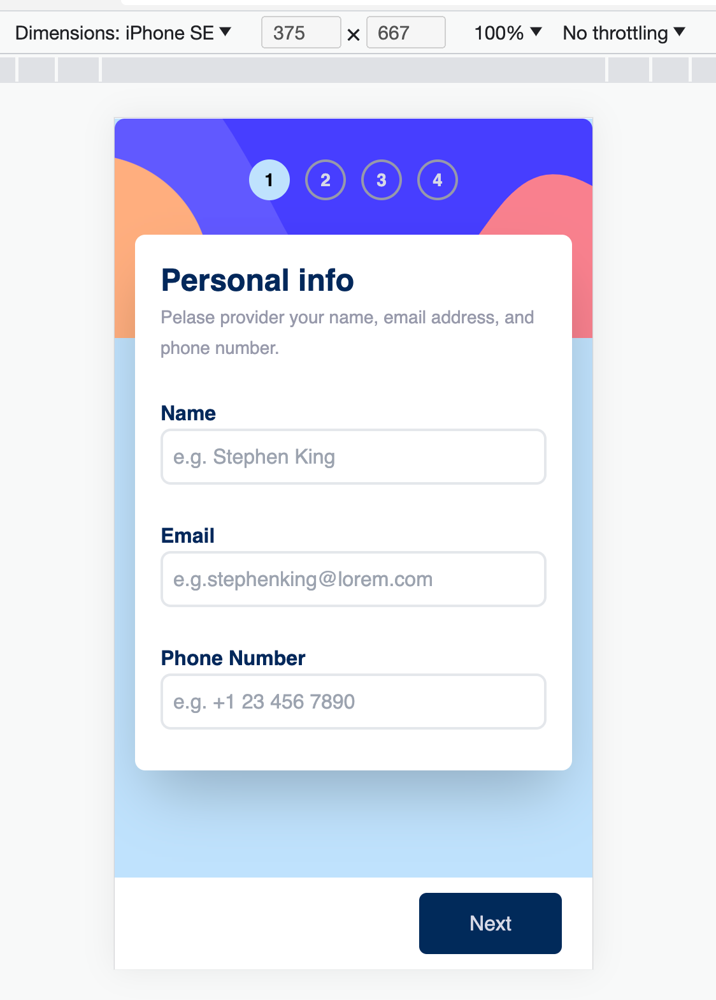
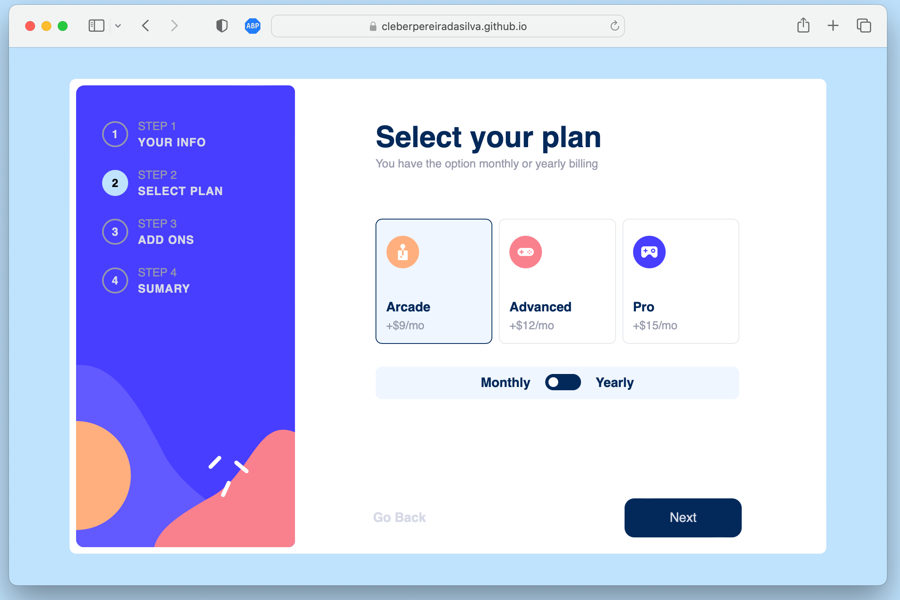

# Frontend Mentor - Multi-step form solution

This is a solution to the [Multi-step form challenge on Frontend Mentor](https://www.frontendmentor.io/challenges/multistep-form-YVAnSdqQBJ). Frontend Mentor challenges help you improve your coding skills by building realistic projects.

## Table of contents

- [Overview](#overview)
  - [The challenge](#the-challenge)
  - [Screenshot](#screenshot)
  - [How to run](#how-to-run)
  - [Links](#links)
- [My process](#my-process)
  - [Built with](#built-with)
  - [Composition](#composition)
- [Author](#author)

## Overview

### The challenge

Users should be able to:

- View the optimal layout for the interface depending on their device's screen size
- See hover and focus states for all interactive elements on the page

### Screenshot

| Destop                                                |                       Mobile                        |
| ----------------------------------------------------- | :-------------------------------------------------: |
|  |  |
|  |  |
|  |  |
|  |  |
|  |  |

### How to run

This is a [Next.js](https://nextjs.org/) project bootstrapped with [`create-next-app`](https://github.com/vercel/next.js/tree/canary/packages/create-next-app).

First, run the development server:

```bash
npm run dev
# or
yarn dev
# or
pnpm dev
```

Open [http://localhost:3000](http://localhost:3000) with your browser to see the result.

### Links

- Live Site URL: [https://cleberpereiradasilva.github.io/multi-form/](https://cleberpereiradasilva.github.io/multi-form/)

### Built with

- CSS custom properties
- Flexbox
- [React](https://reactjs.org/) - JS library
- [Next.js](https://nextjs.org/) - React framework
- [Tailwindcss](https://tailwindcss.com/docs/screens) - For styles
- [Github](https://www.github.com/) - For stored, shared and deploy
- [Redux](https://react-redux.js.org/) - For stored application state
- [Radix](hhttps://www.radix-ui.com/) - Unstyled, accessible components for building high‑quality design systems and web apps in React.

### Composition

I used the composition pattern to create components.

To see how you can create `Form`` component, see below:

```html
<Form.Root className="w-full h-full" onSubmit="{handleSubmit}">
  <div className="h-full w-full flex  flex-col justify-between">
    <Steps.One className={activeStep === 1 ? "" : "hidden"} /> <Steps.Two
    className={activeStep === 2 ? "" : "hidden"} /> <Steps.Three
    className={activeStep === 3 ? "" : "hidden"} /> <Steps.Sumary
    className={activeStep === 4 ? "" : "hidden"} /> <Steps.Thanks
    className={activeStep === 5 ? "" : "hidden"} />
  </div>
</Form.Root>
```

If you want more about composition, I recommend checking out [FrontEnd Mastery](https://frontendmastery.com/posts/advanced-react-component-composition-guide/) to learn more.

## Author

- Website - [Cleber Silva](https://www.clebersilva.dev)
- Frontend Mentor - [@cleberpereiradasilva](https://www.frontendmentor.io/profile/cleberpereiradasilva)
